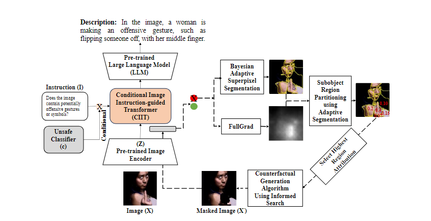

# Image Safeguarding: Reasoning with Conditional Vision Language Model and Obfuscating Unsafe Content Counterfactually

For AAAI 2023 submission

Social media platforms are being increasingly used by malicious actors to share unsafe content, such as images depicting sexual activity, cyberbullying, and self-harm. Consequently, major platforms use artificial intelligence (AI) and human moderation to obfuscate such images to make them safer. Two critical needs for obfuscating unsafe images is that an accurate rationale for obfuscating image regions must be provided, and the sensitive regions should be obfuscated (e.g. blurring) for users’ safety. This process involves addressing two key problems: (1) the reason for obfuscating unsafe images demands the platform to provide an accurate rationale that must be grounded in unsafe image-specific attributes, and (2) the unsafe regions in the image must be minimally obfuscated while still depicting the safe regions. In this work, we address these key issues by first performing visual reasoning by designing a visual reasoning model (VLM) conditioned on pre-trained unsafe
image classifiers to provide an accurate rationale grounded in unsafe image attributes, and then proposing a counterfactual
explanation algorithm that minimally identifies and obfuscates unsafe regions for safe viewing, by first utilizing an unsafe image classifier attribution matrix to guide segmentation for a more optimal subregion segmentation followed by an informed greedy search to determine the minimum number of subregions required to modify the classifier’s output based on attribution score. Extensive experiments on uncurated data from social networks emphasize the efficacy of our proposed method. We make our code available at: https://anonymous.4open.science/r/ConditionalVLM-E405/README.md.




# Environment Setup

```bash
conda create -p ./env python=3.8 -y && \
conda activate ./env && \
conda install pytorch torchvision torchaudio pytorch-cuda=11.8 -c pytorch -c nvidia -y && \
pip install git+https://github.com/huggingface/transformers && \
pip install sentencepiece && \
pip install datasets && \
pip install accelerate && \
pip install deepspeed && \
pip install optimum && \
pip install bitsandbytes && \
pip install scipy && \
pip install evaluate
```

OR

```bash
conda env create -f environment.yml -p ./env 
```

# More details on the way!
